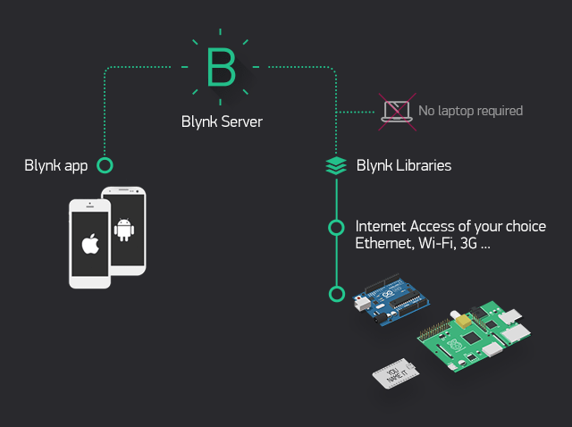

Introduction
=============

Reprinted articles: `here`__.

.. __: http://docs.blynk.cc/#intro

This guide will help you understand how to get started using Blynk and give a comprehensive overview of all the features.

How Blynk Works
----------------

Blynk was designed for the Internet of Things. It can control hardware remotely, it can display sensor data, it can store data, vizualize it and do many other cool things.

There are three major components in the platform:

* **Blynk App** - allows to you create amazing interfaces for your projects using various widgets we provide.

* **Blynk Server** - responsible for all the communications between the smartphone and hardware. You can use our Blynk Cloud or run your `private Blynk server`__ locally. It’s open-source, could easily handle thousands of devices and can even be launched on a Raspberry Pi.

* **Blynk Libraries** - for all the popular hardware platforms - enable communication with the server and process all the incoming and outcoming commands.

.. __: http://docs.blynk.cc/#blynk-server

**Now imagine:** every time you press a Button in the Blynk app, the message travels to space the Blynk Cloud, where it magically finds its way to your hardware. It works the same in the opposite direction and everything happens in a blynk of an eye.

Features
----------

* Similar API & UI for all supported hardware & devices
* Connection to the cloud using:
* WiFi
* Bluetooth and BLE
* Ethernet
* USB (Serial)
* GSM
* …
* Set of easy-to-use Widgets
* Direct pin manipulation with no code writing
* Easy to integrate and add new functionality using virtual pins
* History data monitoring via SuperChart widget
* Device-to-Device communication using Bridge Widget
* Sending emails, tweets, push notifications, etc.
* … new features are constantly added!

You can find `example sketches`__ covering basic Blynk Features. They are included in the library. All the sketches are designed to be easily combined with each other

.. __: https://github.com/blynkkk/blynk-library/tree/master/examples

What do I need to Blynk?
-------------------------

At this point you might be thinking: **“Ok, I want it. What do I need to get started?”** – Just a couple of things, really:

1. Hardware.

   A TA65 Thermostat.  *An Arduino, Raspberry Pi, or a similar development kit.*

   **Blynk works over the Internet.** This means that the hardware you choose should be able to connect to the internet. Some of the boards, like Arduino Uno will need an Ethernet or Wi-Fi Shield to communicate, others are already Internet-enabled: like the ESP8266, Raspberri Pi with WiFi dongle, Particle Photon or SparkFun Blynk Board. But even if you don’t have a shield, you can connect it over USB to your laptop or desktop (it’s a bit more complicated for newbies, but we got you covered). What’s cool, is that the list of hardware that works with Blynk is huge and will keep on growing.

2. A Smartphone.

   The Blynk App is a well designed interface builder. It works on both iOS and Android, so no holywars here, ok?

