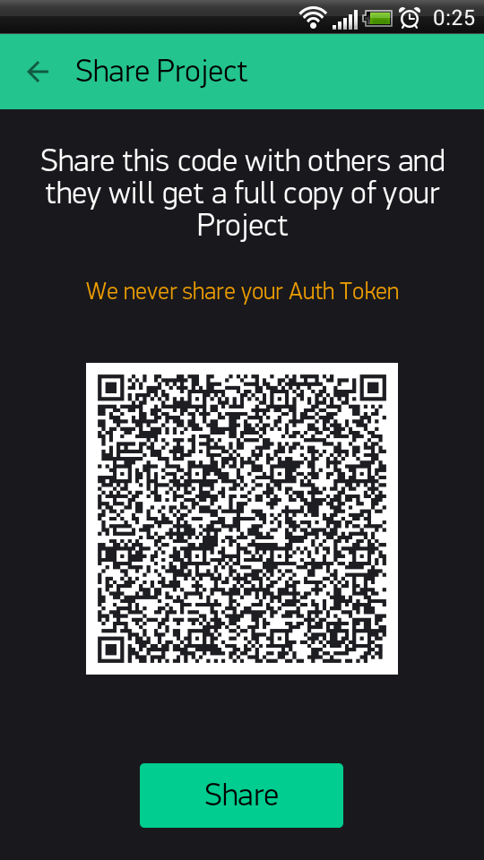
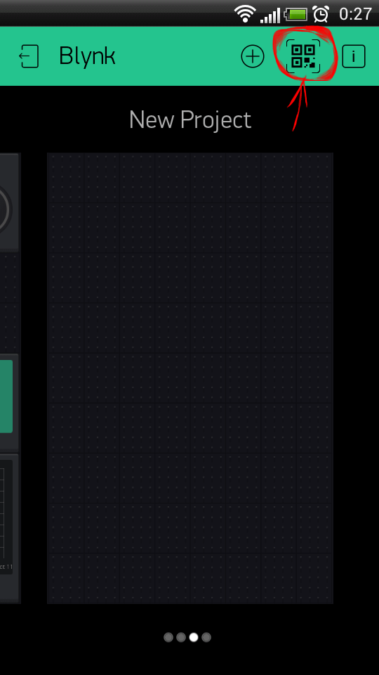

Sharing
========

Blynk offers two types of sharing your projects with other people:

* **Share access to your hardware.** Think about giving someone an App for your Project. They can’t modify, but can control and see what’s there.

* **Share your Project configuration.** Others will get a clone of your project by scanning a given QR link, but they won’t be able to control your hardware. It’s great for tutorials, instructables, etc.

Shared access to your hardware
-------------------------------

Imagine giving someone an App to control your Project.

* people you’ve shared your project with can’t modify anything. They can only use it
* you can update your app, change the layout, add widgets and it’s immediately synced to everyone
* you can revoke access at any moment

How it works: - you send the QR code to your users (you can email, print, post to social media, do whatever you want) - others download Blynk app, scan the QR code and your app opens for them ready to use. They don’t even need to login or create an account.

Go to your Project’s Settings:

Click on “Generate Link” button :

.. image:: ../_static/usage/blynk_usage/dash_settings_sharing_generate.png
    :width: 40%

It will generate QR code you can share with others:

That’s it! Now **Exit the settings and press PLAY button**.

Another person would need to install Blynk app and scan QR code from the login screen (scanning from existing profile is not yet supported) ;

.. note::

    Your Project should be active, don’t forget to press Play button.

.. warning:: 
    
    Sharing costs 1000 energy and this energy is not recoverable even you didn’t use sharing at all.

Share your Project configuration
----------------------------------

In case you want to share your Project’s set up without giving access to your hardware (for example to make a tutorial or instructable)- follow the steps:

In Project’s Settings go to **Clone** button.

It will generate QR code you can share with anyone.

Another person **should Log In to Blynk app** and press QR button in Projects gallery

After the scan, a new Project will be created, all the widgets, settings, layout will be cloned. Another person would need enough Energy Balance to clone your Project.

*Auth Token will be different!.* Nobody will get access to your hardware. They just get a copy of the layout and settings.

HTTP RESTful API
======================

Blynk HTTP RESTful API allows to easily read and write values of Pins in Blynk apps and Hardware.
API description can be found `here`__. 

.. __: http://docs.blynkapi.apiary.io/

.. warning::

    Blynk HTTP API still has GEO DNS issue. This means, for now you need to use direct server IP instead of hostname in order to make it work with 3-d party services like IFTTT.

Troubleshooting
================

Connection
------------

If you experience connection problems, follow these steps:

1. Check that your hardware, wires, cables and power supply are good quality, not harmed or damaged, etc.

    Use high power USB cables and USB ports.

2. Check your wiring using the examples (TCP/HTTP Client or similar) **provided with your shield and hardware.**

    * Once you understand how to manage connection, it’s much easier to use Blynk.
3. Try running command ``telnet blynk-cloud.com 80`` from your PC, connected to the same network as your hardware. You should see something like: ``Connected to blynk-cloud.com..``

4. Try running Blynk default examples for your platform ``without modifications`` to see if it is working.

    * Double-check that you have selected ``the right example`` for your connection type and hardware model.
    * Our examples come with ``comments and explanations. Read them carefully``.
    * Check that your Auth Token is valid (copied from the App and ``doesn’t contain spaces, etc.``)
    * If it doesn’t work, try looking into `serial debug prints`__.

    .. __: http://docs.blynk.cc/#enable-debug

5. Done! Add your modifications and functionality. Enjoy Blynk!

.. note:: 

    when you have multiple devices connected to your network, they should all have different MAC and IP addresses. For example, when using 2 Arduino UNO with Ethernet shields, flashing default example to both of them will cause connection problems. You should use `manual ethernet configuration`__ example.

    .. __: https://github.com/blynkkk/blynk-library/blob/master/examples/Boards_Ethernet/Arduino_Ethernet_Manual/Arduino_Ethernet_Manual.ino

WiFi network connection
--------------------------

If you encounter WiFi connection problems, please check these pitfalls:

    * You’re trying to connect to “WPA & WPA2 Enterprise” network (often used in offices), and your shield does not support this security method
    * Your WiFi network has a login page that requests entering an access token (often used in restaurants)
    * Your WiFi network security disallows connecting alien devices completely (MAC filtering, etc)
    * There is a firewall running. Default port for hardware connections is 80 (8080 on the Local Server). Make sure it’s open.

.. _flood-error:

Flood Error
-------------------

If your code frequently sends a lot of requests to our server, your hardware will be disconnected. Blynk App may show “Your hardware is offline”

When ``Blynk.virtualWrite`` is in the ``void loop``, it generates hundreds of “writes” per second

Here is an example of what may cause flood. *DON’T DO THAT:*

.. code:: c++

    void loop()
    {
    Blynk.virtualWrite(1, value); // This line sends hundreds of messages to Blynk server
    Blynk.run();
    }

*SOLUTION:* If you need to perform actions in time intervals - use timers, for example `BlynkTimer`__.

.. __: http://docs.blynk.cc/#blynk-firmware-blynktimer

Using ``delay()`` will not solve the problem either. It may `cause another`__ issue. Use timers!

.. __: http://docs.blynk.cc/#delay

If sending hundreds of requests is what you need for your product you may increase flood limit on local server and within Blynk library. For local server you need to change ``user.message.quota.limit`` property within ``server.properties`` file :

.. code:: c++

    #100 Req/sec rate limit per user.
    user.message.quota.limit=100

For library you need to change ``BLYNK_MSG_LIMIT`` property within ``BlynkConfig.h`` file :

.. code:: c++

    //Limit the amount of outgoing commands.
    #define BLYNK_MSG_LIMIT 20

Reset password
----------------

On login screen click on “Forgot password?” label and than type your email and ::guilabel:`Send` button. You’ll get instruction on your email.

Android reset password flow
****************************

1. Open instruction email **from your smartphone or tablet**;
2. Click on “Reset now” button in your email;
3. Click on Blynk icon in below popup and reset the pass:

.. _blynk-security:

Security
==============

Blynk server has 5 ports open for different security levels.

    * **80** - plain TCP connection for the hardware (no security)
    * **8080** - plain TCP connection for hardware on the Local Server (no security)
    * **443** - SSL/TLS connection for the Mobile Apps and hardware with SSL
    * **9443** - SSL/TLS connection for the Mobile Apps on the Local Server and hardware with SSL

Hardware may select to connect to 443 (9443) or 80 (8080), depending on it’s capabilities. Connection between the app and the server is always is done through SSL/TLS, so it is always secured. Connection between the hardware and server depends on your hardware capabilities. With the Local Blynk server connection type between the hardware and server is not that important for the security as the Local server is usually placed within the local network, so attacker can’t intercept traffic between hardware and the server.

Use Local Blynk Server
-------------------------

In order to gain maximum security you could install `Blynk Server`_ locally and restrict access to your network, so nobody except you could access it. In this case all data is stored locally within your network and not send via Internet.

In case of Local Blynk Server there is also no need to protect connection between your hardware and Local Blynk Server. This is true for Ethernet connection and partially true for Wi-Fi connection. In case of Wi-Fi you have to use at least WPA, WPA2 (Wi-Fi Protected Access) Wi-Fi type in order to protect wireless traffic.

WPA and WPA2 offer a very robust encryption that is likely to protect all data travelling over the air—given that a strong enough password is used. Even if your data is plain TCP/IP, another user won’t be able to decipher captured packets. Still, make sure that your password is strong enough, otherwise the only limiting factor for an attacker is time.

Use SSL gateway
---------------

Most platforms are not capable to handle SSL, so they connect to 80. However, our `gateway script`__ can be used to add SSL security layer to communication.

.. __: https://github.com/blynkkk/blynk-library/blob/master/scripts/blynk-ser.sh

.. code:: bash

    ./blynk-ser.sh -f SSL

This will forward all hardware connections from 9443 port to the server via SSL gateway. You can run this script on your Raspberry Pi, desktop computer, or even directly on your router!

.. note::

    when using your own server, you should overwrite the bundled server.crt certificate, or specify it to the script using ``--cert`` switch:

.. code:: bash

    ./blynk-ser.sh -f SSL -s <server ip> -p 9443 --cert=<certificate>.crt
    
Flag ``-f SSL`` is enabled by default for USB communication so you don’t have to explicit declare it.

.. note::

    SSL is supported by the gateway only on Linux/OSX for now

If you want to skip SSL, and connect to TCP, you can also do that:

.. note::

    ./blynk-ser.sh -t TCP

OTA
=========

See `here`__.

.. __: http://docs.blynk.cc/#ota

Blynk Server
===============

Blynk server is an Open Source Java server, responsible for forwarding messages between Blynk mobile application and various microcontroller boards (i.e. Arduino, Raspberry Pi. etc).

Download latest server build:

`DOWNLOAD BLYNK SERVER`__

.. __: https://github.com/blynkkk/blynk-server/releases

Why do I need Local Blynk Server?
------------------------------------

* Better security. You are the only one who knows about the server. You can setup security policies tied to your specific needs (MAC, IPs, login names, etc). You can also make it accessible only within your private network.
* Better stability. No need to rely on 3rd party Cloud solution. You have the full control.
* Lower latency. Server is as close to you as it could be.
* Maximum privacy. All data is stored locally and is not shared with anyone.

Installing your own Local Blynk Server
-----------------------------------------

For detailed instruction please follow `github page`__.

.. __: https://github.com/blynkkk/blynk-server#blynk-server

Blynk Firmware
===============

See `here`__.

.. __: http://docs.blynk.cc/#blynk-firmware

.. _digital_analog_pins_control:

Digital & Analog pins control
----------------------------------

Blynk library can perform basic pin IO (input-output) operations out-of-the-box:

.. code::

    digitalRead
    digitalWrite
    analogRead
    analogWrite (PWM or Analog signal depending on the platform)

No need to write code for simple things like LED, Relay control and analog sensors. Just choose a corresponding Pin in Blynk app and control it directly with no additional code

.. _virtual-pins-control:

Virtual pins control
---------------------

Virtual Pins is a way to exchange any data between your hardware and Blynk app. Think about Virtual Pins as channels for sending any data. Make sure you differentiate Virtual Pins from physical GPIO pins on your hardware. Virtual Pins have no physical representation.

Virtual Pins are commonly used to interface with other libraries (Servo, LCD and others) and implement custom logic. The device can send data to the App using ``Blynk.virtualWrite(pin, value)`` and receive data from the App using ``BLYNK_WRITE(vPIN).`` Read below

.. _virtual-pin-data-types:

Virtual Pin data types
************************

All Virtual Pin values are always sent as Strings and there are no practical limits on the data that can be sent.
However, there are certian limitations on the hardware side when dealing with numbers. For example, the integer on Arduino is 16-bit, allowing range -32768 to 32767.

To interpret incoming data as **Integers**, **Floats**, **Doubles** and **Strings** use:

.. code::

    param.asInt();
    param.asFloat();
    param.asDouble();
    param.asStr();

You can also get the RAW data from the param buffer:

.. code::

    param.getBuffer()
    param.getLength()

FAQ
============

* I backed Blynk on Kickstarter. Where are my widgets and why the app is free?

    App is free because otherwise you would have to pay to download it. This is how AppStore and Google Play works. Current Blynk release has a limited amount of widgets. We decided to make them free for everyone until we implement store. After that, every widget will be paid. However every backer will get them for free (according to their pledge).

* What is Blynk Cloud?

    Blynk Cloud is a open-source software written on Java using plain TCP/IP and secured TCP/IP (for hardware that supports it) sockets and running on our server. Blynk iOS and Android apps connect to Blynk Cloud by default. Access is free for every Blynk user. We also provide a Private Server distribution for those who want to install `Blynk Server`_ locally.

* How much access to Cloud Blynk server cost?

    It is free for every Blynk user.

* Can I run Blynk server locally?

    Yes. Those of you, who want extra security or don’t have internet connection, can install Local Blynk server and run it in your own local network. Blynk server is Open-Source and it takes less than few seconds to deploy. All the instructions and files are `Blynk Server`_ .

* What are the requirements to run Private Blynk server?

    To run Private Blynk server, all you need is Java Runtime Environment.

* Can I run Blynk server on Raspberry Pi?

    Yes, surely! Here is `instruction`__.

    .. __: http://docs.blynk.cc/#blynk-server-how-to-run-local-blynk-server-launch-blynk-server-on-raspberry-pi

* Does Blynk app work over Bluetooth?

    Yes. It is in beta right now.

* Does Blynk server store sensor data when app goes offline?

    Yes, every command that hardware sends to server is stored. You could use :ref:`superchart` widget in order to view it.

*  Why app requires all this permissions?

    http://help.blynk.cc/faq/blynk-android-permissions-explained

