.. _blynk_widgets:

WIDGETS
########

Reprinted articles: `here`__.

.. __: http://docs.blynk.cc/#widgets

Widgets are interface modules. Each of them performs a specific input/ output function when communicating with the hardware.

There are 4 types of Widgets:

* **Controllers** - used to send commands that control your hardware
* **Displays** - used for data visualization from sensors and other sources;
* **Notifications** - send messages and notifications;
* **Interface** - widgets to perform certain GUI functions;
* **Other** - widgets that don’t belong to any category;

Each Widget has it’s own settings. Some of the Widgets (e.g. Bridge) just enable functionality and they don’t have any settings.

Common Widget Settings
======================

Pin Selector
------------

This is one of the main parameters you need to set. It defines which pin to control or to read from.

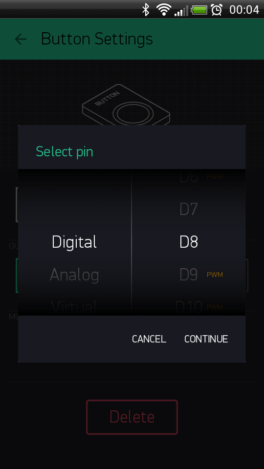

* **Digital Pins** - represent physical Digital IO pins on your hardware. PWM-enabled pins are marked with the `~` symbol

* **Analog Pins** - represent physical Analog IO pins on your hardware

* **Virtual Pins** - have no physical representation. They are used to transfer any data between Blynk App and your hardware. Read more about Virtual Pins :ref:`virtual-pins`.

Data Mapping
------------

In case you want to map incoming values to specific range you may use mapping button:

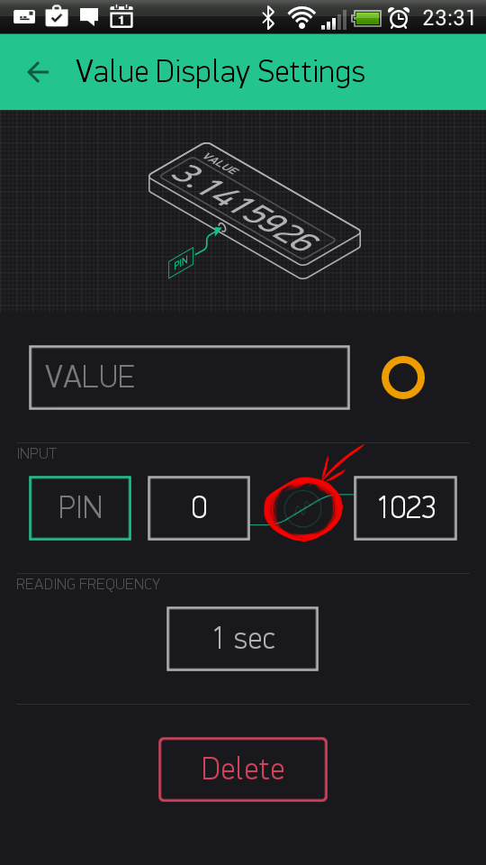

Let’s say your sensor sends values from 0 to 1023. But you want to display values in a range 0 to 100 in the app. When Data Mapping enabled, incoming value 1023 will be mapped to 100.

SPLIT/MERGE
------------

Some of the Widgets can send more than one value. And with this switch you can control how to send them.

* **SPLIT**: Each of the parameters is sent directly to the Pin on your hardware (e.g D7). You don’t need to write any code.

    .. note::
        
        In this mode you send multiple commands from one widget, which can reduce performance of your hardware.

    Example: If you have a Joystick Widget and it’s set to D3 and D4, it will send 2 commands over the Internet:

    .. code:: c++

        digitalWrite(3, value);
        digitalWrite(4, value);

* **MERGE**: When MERGE mode is selected, you are sending just 1 message, consisting of array of values. But you’ll need to parse it on the hardware.

    This mode can be used with Virtual Pins only.

    Example: Add a zeRGBa Widget and set it to MERGE mode. Choose Virtual Pin V1

    .. code:: c++

        BLYNK_WRITE(V1) // There is a Widget that WRITEs data to V1 
        {
            int r = param[0].asInt(); // get a RED channel value
            int g = param[1].asInt(); // get a GREEN channel value
            int b = param[2].asInt(); // get a BLUE channel value
        }

Decimals
-----------

Defines how many decimals you would like to see when moving a Slider. When “No Fraction” is chosen, slider will only send integer values with no decimals. “1 digit” means that values will look like 1.1, 1.2, …, 2.0, etc.

Send On Release
----------------

This option allows you to optimize data traffic on your hardware.

For example, when you move joystick widget, commands are streamed to the hardware, during a single joystick move you can send dozens of commands. There are use-cases where it’s needed, however creating such a load may lead to hardware overload and reset. **Send On Release** is a recommended setting for majority of applications. This is also a default setting.

Write interval
---------------

Similar to “Send on Release” option. However, it allows you to stream values to your hardware within certain interval. For example, setting **write interval** to 100 ms means that while you move the slider, only 1 value will be sent to hardware within 100 ms period. This option is also used to optimize data traffic flow to your hardware.

Color gradient
---------------

When you choose gradient, it affects the color of widget elements based on invoming values. For example: You set Gauge Widget with Min and Max parameters of 0-100, and choose green-yellow-red gradient. When hardware sends: - `10`, Gauge will change it’s color to green color - `50` will change Gauge to yellow color - `80` will change Gauge to red color

There are 2 types of gradients you can choose from: - Warm: Green - Orange - Red; - Cold: Green - Blue - Violet;

.. _controllers:

Controllers
============

Button
-------

Works in push or switch modes. Allows to send ON and OFF (LOW/HIGH) values. Button sends 1 (HIGH) on press and sends 0 (LOW) on release.

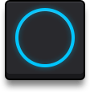

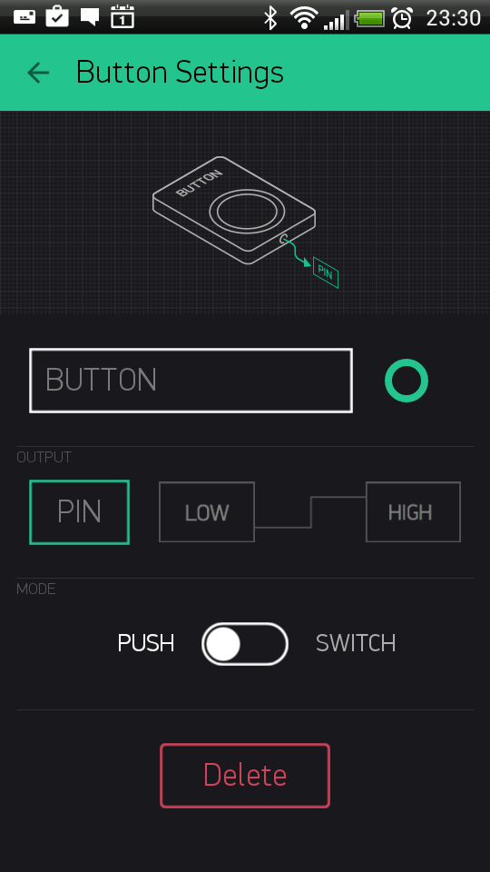

Sketch: `BlynkBlink`__

.. __: https://github.com/blynkkk/blynk-library/blob/master/examples/GettingStarted/BlynkBlink/BlynkBlink.ino

Slider
-----------

Similar to potentiometer. Allows to send values between in a given MIN/MAX range.

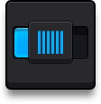

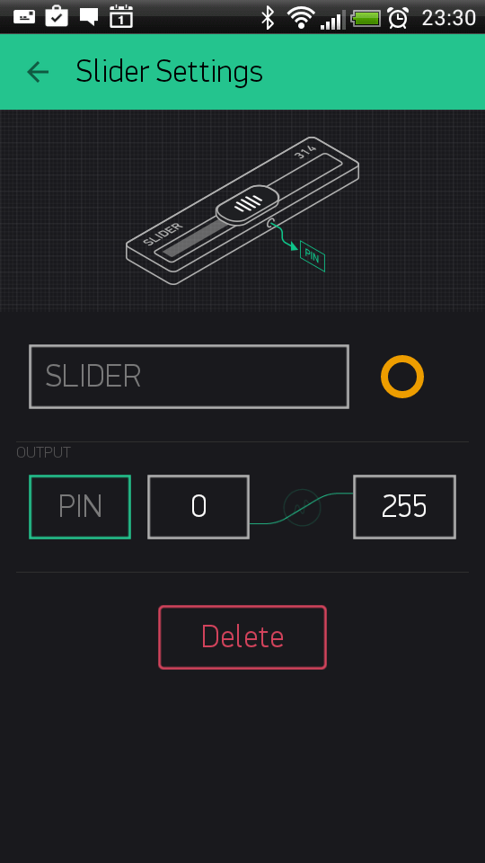

Sketch: `BlynkBlink`__

.. __: https://github.com/blynkkk/blynk-library/blob/master/examples/GettingStarted/BlynkBlink/BlynkBlink.ino

Timer
-------------

Timer triggers actions at a specified time. Even if smartphone and app is offline. Start time sends 1 (HIGH). Stop time sends 0 (LOW).

Recent Android version also has improved Timer within Eventor widget. With Eventor Time Event you can assign multiple timers on same pin, send any string/value, select days and timezone. It is recommended to use Eventor over Timer widget. However Timer widget is still suitable for simple timer events.

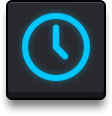

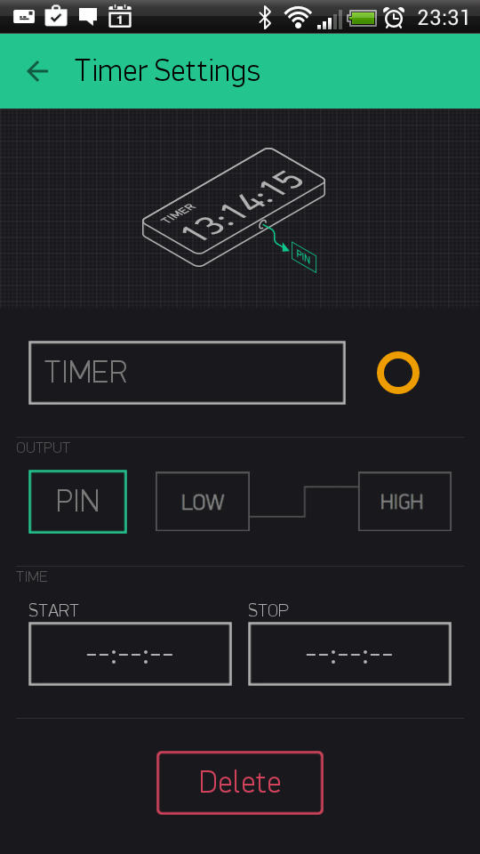

.. note:: 
    
    The timer widget rely on the server time and not your phone time. Sometimes the phone time may not match the server time.

Sketch: `Timer`__

.. __: https://github.com/blynkkk/blynk-library/blob/master/examples/Widgets/Timer/Timer.ino

Joystick
------------

Control servo movements in 4 directions

**Settings:**

* SPLIT/MERGE modes - read `here`__
* **Rotate on Tilt**

.. __: http://docs.blynk.cc/#widgets-common-widget-settings-splitmerge

When it’s ON, Joystck will automatically rotate if you use your smartphone in landscape orientation
- **Auto-Return** - When it’s OFF, Joystick handle will not return back to center position. It will stay where you left it.

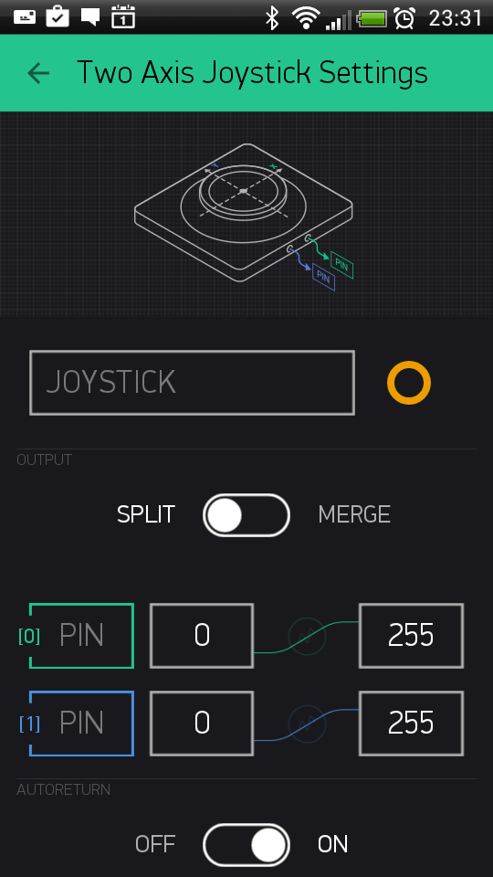

Sketch: `JoystickTwoAxis`__

.. __: https://github.com/blynkkk/blynk-library/blob/master/examples/Widgets/JoystickTwoAxis/JoystickTwoAxis.ino

zeRGBa
---------

zeRGBa is a usual RGB color picker + brightness picker

**Settings**:

* **SPLIT**: Each of the parameters is sent directly to the Pin on your hardware (e.g D7). You don’t need to write any code.

    .. note:: 
        
        In this mode you send multiple commands from one widget, which can reduce performance of your hardware.

    Example: If you have a zeRGBa Widget and it’s set to D1, D2, D3 it will send 3 commands over the Internet:

    .. code:: c++

        digitalWrite(1, r);
        digitalWrite(2, g);
        digitalWrite(3, b);

* **MERGE**: When MERGE mode is selected, you send 1 message with an array of values inside. You would need to parse the message on the hardware.

    This mode can be used with Virtual Pins only.

    Example: Add a zeRGBa Widget and set it to MERGE mode. Choose Virtual Pin V1.

    .. code:: c++

        BLYNK_WRITE(V1) // zeRGBa assigned to V1 
        {
            // get a RED channel value
            int r = param[0].asInt();
            // get a GREEN channel value
            int g = param[1].asInt();
            // get a BLUE channel value
            int b = param[2].asInt();
        }

Step Control
----------------

Step Control is used to set granular values with a given step

2 buttons are assigned to 1 pin. One button increments the value, another one decrements it.

**Send Step** option allows you to send step value to hardware instead of actual value of step widget. **Loop value** option allows you to reset step widget to start value when maximum value is reached.

Sketch: `Basic Sketch`__

.. __: https://github.com/blynkkk/blynk-library/blob/master/examples/GettingStarted/BlynkBlink/BlynkBlink.ino

Displays
==========

Value Display
--------------

Displays incoming data.

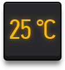

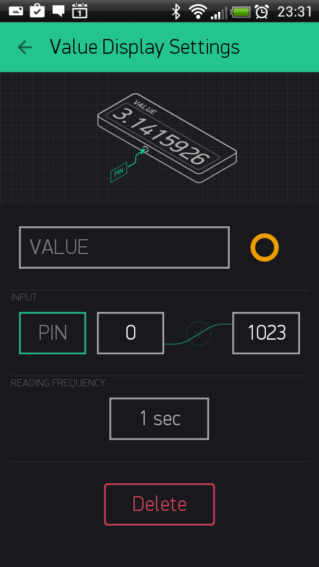

Sketch: `BlynkBlink`__

.. __: https://github.com/blynkkk/blynk-library/blob/master/examples/GettingStarted/BlynkBlink/BlynkBlink.ino

Labeled Value
-------------

Displays incoming data in a formatted wayt. It is a better version of ‘Value Display’ where you can add suffixes and prefixes on the app side, with no coding on the hardware.

.. image:: ../_static/usage/blynk_usage/labeled_value.png
    :width: 15%

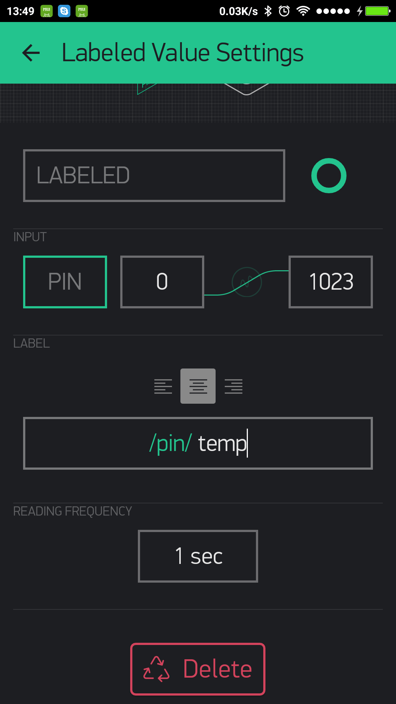

Sketch: `BlynkBlink`__

.. __: https://github.com/blynkkk/blynk-library/blob/master/examples/GettingStarted/BlynkBlink/BlynkBlink.ino

**Formatting options**

For example: your sensor sends vaule of 12.6789 to Blynk application. Next formatting options are supported:

``/pin/`` - displays the value without formatting (12.6789)

``/pin./`` - displays the rounded value without decimal part (13)

``/pin.#/`` - displays the value with 1 decimal digit (12.7)

``/pin.##/`` - displays the value with two decimal places (12.68)

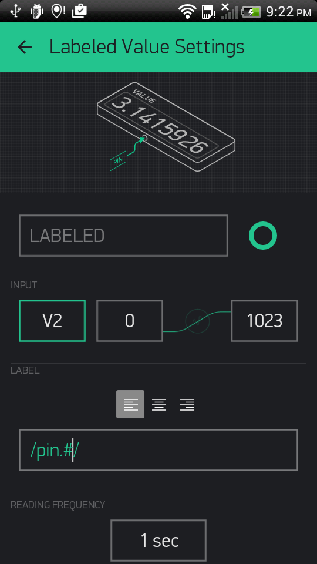

LED
-----

A simple LED for indication. You need to send 0 in order to turn LED off. And 255 in order to turn LED on. Or just use Blynk API as described below:

.. code:: c++

    WidgetLED led1(V1); //register to virtual pin 1
    led1.off();
    led1.on();

All values between 0 and 255 will change LED brightness:

.. code:: c++

    WidgetLED led2(V2);
    led2.setValue(127); //set brightness of LED to 50%.

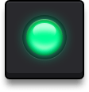

Sketch: `LED`__

.. __: https://github.com/blynkkk/blynk-library/blob/master/examples/Widgets/LED/LED_Blink/LED_Blink.ino

Gauge
--------

Visual display of numeric values.

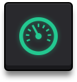

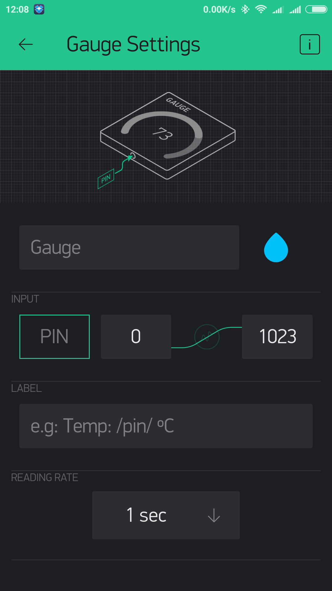

Sketch: `BlynkBlink`__

.. __: https://github.com/blynkkk/blynk-library/blob/master/examples/GettingStarted/BlynkBlink/BlynkBlink.ino

**Formatting options**

For example: your sensor sends vaule of 12.6789 to Blynk application. Next formatting options are supported:

/pin/ - displays the value without formatting (12.6789)

/pin./ - displays the rounded value without decimal part (13)

/pin.#/ - displays the value with 1 decimal digit (12.7)

/pin.##/ - displays the value with two decimal places (12.68)

LCD
--------

This is a regular 16x2 LCD display made in our secret facility in China.

**SIMPLE / ADVANCED MODE**

**Commands**

You need to use special commands with this widget:

.. code:: c++

    lcd.print(x, y, "Your Message");

Where x is a symbol position (0-15), y is a line id (0 or 1),

.. code:: c++

    lcd.clear();

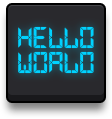

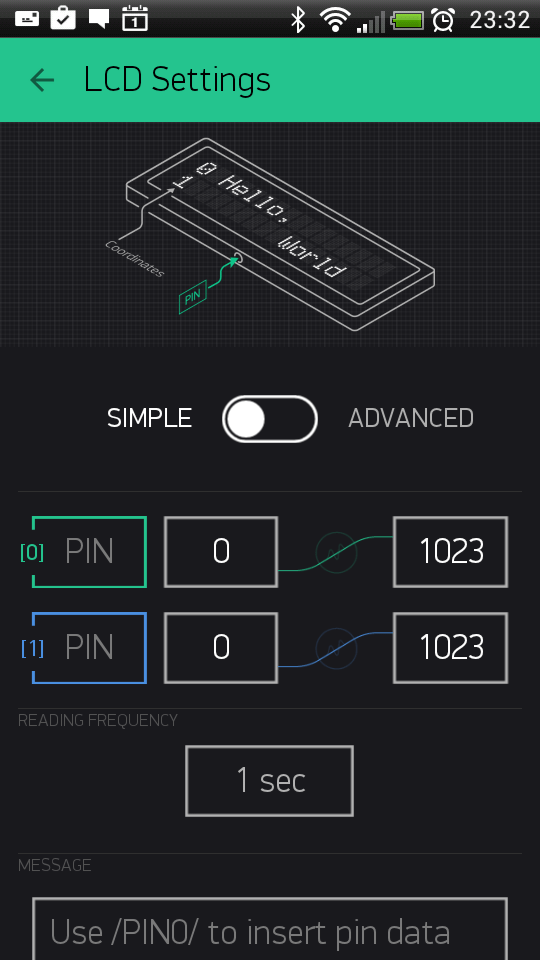

Sketch: `LCD Advanced Mode`__  Sketch: `LCD Simple Mode Pushing`__  Sketch: `LCD Simple Mode Reading`__

.. __: https://github.com/blynkkk/blynk-library/blob/master/examples/Widgets/LCD/LCD_AdvancedMode/LCD_AdvancedMode.ino
.. __: https://github.com/blynkkk/blynk-library/blob/master/examples/Widgets/LCD/LCD_SimpleModePushing/LCD_SimpleModePushing.ino
.. __: https://github.com/blynkkk/blynk-library/blob/master/examples/Widgets/LCD/LCD_SimpleModeReading/LCD_SimpleModeReading.ino

**Formatting options**

For example: your sensor sends vaule of 12.6789 to Blynk application. Next formatting options are supported:

``/pin/`` - displays the value without formatting (12.6789)

``/pin./`` - displays the rounded value without decimal part (13)

``/pin.#/`` - displays the value with 1 decimal digit (12.7)

``/pin.##/`` - displays the value with two decimal places (12.68)

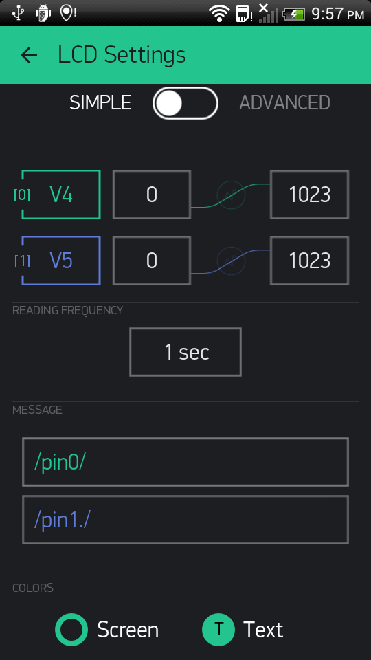

.. _superchart:

SuperChart
--------------

SuperChart is used to visualise live and historical data. You can use it for sensor data, for binary event logging and more.

| To use SuperChart widget you would need to push the data from the hardware with the desired interval by using timers.
| `Here is`__ a basic example for data pushing.

.. __: https://examples.blynk.cc/?board=ESP8266&shield=ESP8266%20WiFi&example=GettingStarted%2FPushData

Interactions:
**************

* **Switch between time ranges and Live mode**
    Tap time ranges at the bottom of the widget to change time ranges

* **Tap Legend Elements** to show or hide datastreams

* **Tap ’n’ hold to view timestamp and corresponding values**

    .. image:: ../_static/usage/blynk_usage/tapnhold_charts.png
        :width: 40%

* **Quick swipe from left to right to reveal previous data**

    .. image:: ../_static/usage/blynk_usage/swipe_charts.png
        :width: 40%

    Then you can then scroll data back and forward within the given time range.

* **Full Screen Mode**

    Press this button to open Full Screen view in landscape orientation:

    .. image:: ../_static/usage/blynk_usage/fullscreen_charts.png
        :width: 40%

    Simply rotate the phone back to portrait mode. Chart should rotate automagically. In full screen view you will see X (time) and multiple Y scales. Full Screen Mode can be disabled from widget Settings.

* **Menu Button**

    Menu button will open additional functions:

    * Export to CSV
    * Erase Data on the server

    .. image:: ../_static/usage/blynk_usage/menu_charts.png
        :width: 40%

SuperChart Settings:
********************

* **Chart Title**
* **Title Font Size** You have a choice of 3 font sizes
* **Title Alignment** Choose chart title alignment. This setting also affects Title and Legend position on the Widget.
* **Show x-axis (time)** Select it if you want to show the time label at the bottom of your chart.
* **Time ranges** picker Allows you to select required periods (``15m``, ``30m``, ``1h``, ``3h``, …) and resolution for your chart. Resolution defines how precise your data is. Right now chart supports 2 types of resolution ``standard`` and ``high``. Resolution also depends on the selected period. For example, ``standard`` resolution for ``1d`` means you’ll get 24 points per day (1 per hour), with ``high`` resolution you’ll get for ``1d`` 1440 points per day (1 per minute).
* **Datastreams** - add datastreams (read below how to configure datastreams)

Datastream Settings:
********************

Widget supports up to 4 Datastreams. Press Datastream Settings Icon to open Datastream Settings.

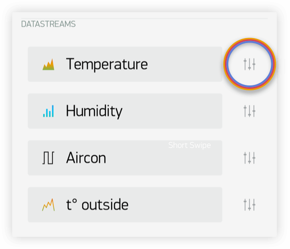

* **Design:** Choose available types of Chart:

    * Line
    * Area
    * Bar
    * Binary (anchor LINK to binary)

* **Color:** Choose solid colors or gradients

* **Source and input:** You can use 3 types of Data source:

    1. **Virtual Pin** Choose the desired Device and Virtual Pin to read the data from.

    2. **Tags** SuperChart can aggregate data from multiple devices using built-in aggregation functions. For example, if you have 10 Temperature sensors sending temperature with the given period, you can plot average value from 10 sensors on the widget.

        To use Tags:

        * Add :ref:`tags` to every device you want to aggregate data from.
        * **Push data to the same Virtual Pin** on every device. (e.g. ``Blynk.virtualWrite (V0, temperature);``)
        * **Choose Tag as a source** in SuperChart Widget and use the pin where the data is coming to (e.g V0)
    
        Functions available:

        * SUM, will summarize all incoming values to the specified Virtual Pin across all devices tagged with the chosen tag
        * AVG, will plot average value
        * MED, will find a median value
        * MIN, will plot minimum value
        * MAX will plot maximum value

        .. important::
        
            Tags are not working in Live Mode.

    3. `Device Selector`_ If you add Device Selector Widget to your project, you can use it as a source for SuperChart. In this case, when you change the device in Device Selector, chart will be updated accordingly

* **Y-Axis Settings**

    There are 4 modes of how to scale data along the Y axis:

    1. Auto
        Data will be auto-scaled based on min and max values of the given time period. This is nice option to start with.

    2. Values
        When this mode is selected, Y scale will be set to the values you choose. For example, if your hardware sends data with values varying from -100 to 100, you can set the chart to this values and data will be rendered correctly.

        .. image:: ../_static/usage/blynk_usage/yScale_manual_charts.png
            :width: 40%

        You may also want to visualize the data within some specific range. Let’s say incoming data has values in the range of 0-55, but you would like to see only values in the range 30-50. You can set it up and if values are out of Y scale you configured, chart will be cropped

    3. % of Height
        This option allows you to auto-scale incoming data on the widget and position it the way you want. In this mode, you set up the percentage of widget height on the screen, from 0% to 100%.

        .. image:: ../_static/usage/blynk_usage/yheight2_charts.png
            :width: 40%

        If you set 0-100%, in fact it’s a full auto-scale. No matter in which range the data is coming,
        it will be always scaled to the whole height of the widget.

        If you set it to 0-25%, then this chart will only be rendered on 1/4 of the widget height: 

        .. image:: ../_static/usage/blynk_usage/yheight2_manual_charts.png
            :width: 40%

        This setting is very valuable for **Binary Chart** or for visualizing a few datastreams on the same chart in a different way.

        .. image:: ../_static/usage/blynk_usage/binary_charts.png
            :width: 40%

    4. Delta
        While data stays within the given Delta value, chart will be auto-scaled within this range. If delta exceeds the range, chart will be auto-scaled to min/max values of the given period.

* **Suffix:**

    Here you can specify a suffix that will be shown during the Tap ’n’ hold

* **Decimals:**

    Defines the formatting of the graph value when you Tap’n’hold the graph. Possible options are: #, #.#, #.##, etc.

* **Connect Missing Data Points:**

    If this switch is ON, then SuperChart will connect all the dots even if there was no data

    .. image:: ../_static/usage/blynk_usage/datapoints1_charts.png
        :width: 40%

    If it’s set to OFF, then you will see gaps in case there was no data.

    .. image:: ../_static/usage/blynk_usage/datapoints2_charts.png
        :width: 40%

* **Binary Chart Settings:**

    This type of chart is useful to plot binary data, for example when unit was ON or OFF, or when motion was detected or when certain threshold was reached.

    * **FLIP:**
        You need to specify a **FLIP** point, which is the point where incoming data will be turned into TRUE or FALSE state.

        For example, you send the data in the range of ``0 to 1023``. If you set ``512`` as a **FLIP** point, then everything above ``512`` (excluding 512) will be recorded as ``TRUE``, any value below ``512`` (including 512) will be ``FALSE``.

        Another example, if you send ``0 and 1`` and set ``0`` as a **FLIP** point, then ``1`` will be ``TRUE``, ``0`` will be ``FALSE``

    * **State Labels:**
        Here you can specify how ``TRUE/FALSE`` should be shown in Tap ’n’ Hold mode.

        For example, you can set to ``TRUE`` to “Equipment ON” label, ``FALSE`` to “Equipment OFF”.

        .. image:: ../_static/usage/blynk_usage/binarylabel_charts.png
            :width: 40%

Granularity:
************

Superchart supports currently 2 types of granularity:

* Minute granularity - ``1h``, ``6h``, ``1d``;
* Hour granularity - ``1w``, ``1m``, ``3m``;

This means that minimum chart update interval is 1 minute for ``1h``, ``6h``, ``1d`` periods. 1 hour for ``1w``, ``1m`` and ``3m`` periods. As Blynk Cloud is free to use we have a limit on how many data you can store. At the moment Blynk Cloud accepts 1 message per minute per pin. In case you send your data more frequently your values will be averaged. For example, in case you send value ``10`` at 12:12:05 and than again ``12`` at 12:12:45 as result in chart you’ll see value ``11`` for 12:12.

In order to see data in chart you need to use either widgets with “Frequency reading” interval (in that case your app should be open and running) or you can use ``Blynk.virtualWrite`` on hardware side. Every ``Blynk.virtualWrite`` command is stored on server automatically. In that case you don’t need application to be up and running.

Terminal
-----------

Displays data from your hardware. Allows to send any string to your hardware. Terminal always stores last 25 messages your hardware had send to Blynk Cloud. This limit may be increased on Local Server with ``terminal.strings.pool.size`` property.

You need to use special commands with this widget:

.. code:: c++

    terminal.print();   // Print values, like Serial.print
    terminal.println(); // Print values, like Serial.println()
    terminal.write();   // Write a raw data buffer
    terminal.flush();   // Ensure that data was sent out of device
    terminal.clear();   // Erase all values in the terminal

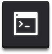

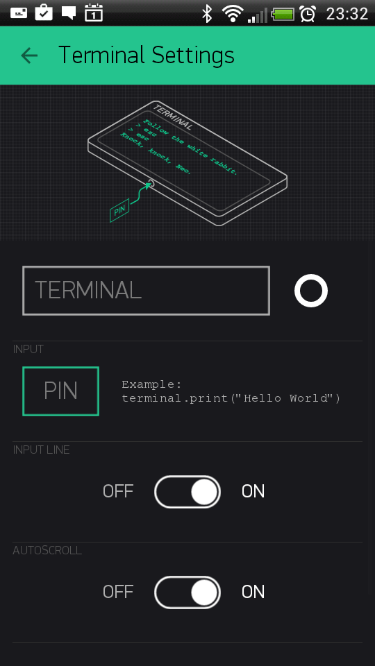

Sketch: `Terminal`__

.. __: https://github.com/blynkkk/blynk-library/blob/master/examples/Widgets/Terminal/Terminal.ino

Video Streaming
-----------------

Simple widget that allows you to display any live stream. Widget supports RTSP (RP, SDP), HTTP/S progressive streaming, HTTP/S live streaming. For more info please follow `official Android documentation`__.

.. __: https://developer.android.com/guide/appendix/media-formats.html

At the moment Blynk doesn’t provide streaming servers. So you can either stream directly from camera, use 3-d party services or host streaming server on own server (on raspberry for example).

You can also change video url from hardware with:

.. code:: c++

    Blynk.setProperty(V1, "url", "http://my_new_video_url");

Level Display
---------------

Level Display is very similar to progress bar, when you need to visualize a level betwen min/max value To update Level Display from hardware side with code:

.. code:: c++

    Blynk.virtualWrite(V1, val);

Every message that hardware sends to server is stored automatically on server. PUSH mode doesn’t require application to be online or opened.

Sketch: `Push Example`__

.. __: https://github.com/blynkkk/blynk-library/blob/master/examples/GettingStarted/PushData/PushData.ino

Notifications
==============

Twitter
-------

Twitter widget connects your Twitter account to Blynk and allows you to send Tweets from your hardware.

Example code:

.. code:: c++

    Blynk.tweet("Hey, Blynkers! My Arduino can tweet now!");

Limitations:
    * you cant’ send 2 tweets with same message (it’s Twitter policy)
    * only 1 tweet per 5 seconds is allowed

**Sketch**: `Twitter`__

.. __: https://github.com/blynkkk/blynk-library/blob/master/examples/Widgets/Twitter/Twitter.ino

Email
-------

Email widget allows you to send email from your hardware to any address.

Example code:

.. code:: c++

    Blynk.email("my_email@example.com", "Subject", "Your message goes here");

It also contains ``to`` field. With this field you may define receiver of email in the app. You may skip ``to`` field when you want to send email to your Blynk app login email:

.. code:: c++

    Blynk.email("Subject", "Your message goes here");
    
You can send either ``text/html`` or ``text/plain`` (some clients don’t support ``text/html``) email. You can change this content type of email in the Mail widget settings.

Additionally you may use ``{DEVICE_NAME}``, ``{DEVICE_OWNER_EMAIL}`` and ``{VENDOR_EMAIL}`` (for the local server) placeholders in the mail for the to, subject and body fields:

.. code:: c++

    Blynk.email("{DEVICE_OWNER_EMAIL}", "{DEVICE_NAME} : Alarm", "Your {DEVICE_NAME} has critical error!");

Limitations:
    * Maximum allowed email + subject + message length is 120 symbols. However you can increase this limit if necessary by adding ``#define BLYNK_MAX_SENDBYTES XXX`` to you sketch. Where ``XXX`` is desired max length of your email. For example for ESP you can set this to 1200 max length ``#define BLYNK_MAX_SENDBYTES 1200``. The ``#define BLYNK_MAX_SENDBYTES 1200`` must be included before any of the Blynk includes.
    * Only 1 email per 5 seconds is allowed
    * In case you are using gmail on the Local Server you are limited with 500 mails per day (by google). Other providers may have similar limitations, so please be careful.
    * User is limited with 100 messages per day in the Blynk Cloud;

**Sketch**: `Email`__

.. __: https://github.com/blynkkk/blynk-library/blob/master/examples/Widgets/Email/Email.ino

Push Notifications
-------------------

Push Notification widget allows you to send push notification from your hardware to your device. Currently it also contains 2 additional options:

    * **Notify when hardware offline** - you will get push notification in case your hardware went offline.
    * **Offline Ignore Period** - defines how long hardware could be offline (after it went offline) before sending notification. In case period is exceeded - “hardware offline” notification will be send. You will get no notification in case hardware was reconnected within specified period.
    * **Priority** high priority gives more chances that your message will be delivered without any delays. See detailed explanation `here`__.

    .. __: https://developers.google.com/cloud-messaging/concept-options#setting-the-priority-of-a-message

.. warning::

    high priority contributes more to battery drain compared to normal priority messages.

Example code:

.. code:: c++

    Blynk.notify("Hey, Blynkers! My hardware can push now!");

You can also use placeholder for device name, that will be replaced on the server with your device name:

.. code:: c++

    Blynk.notify("Hey, Blynkers! My {DEVICE_NAME} can push now!");

Limitations:
    * Maximum allowed body length is 120 symbols;
    * Every device can send only 1 notification every 5 seconds;

**Sketch**: `PushNotification`__

.. __: https://github.com/blynkkk/blynk-library/blob/master/examples/Widgets/PushNotification/PushNotification_Button/PushNotification_Button.ino

Unicode in notify, email, push, …
-----------------------------------

The library handles all strings as UTF8 Unicode. If you’re facing problems, try to print your message to the Serial and see if it works (the terminal should be set to UTF-8 encoding). If it doesn’t work, probably you should read about unicode support of your compiler.
If it works, but your message is truncated - you need to increase message length limit (all Unicode symbols consume at least twice the size of Latin symbols).

Increasing message length limit
--------------------------------------

You can increase maximum message length by putting on the top of your sketch (before Blynk includes):

.. code:: c++

    #define BLYNK_MAX_SENDBYTES 256 // Default is 128

Interface
===========

Tabs
------

The only purpose of Tabs widget is to extend your project space. You can have up to 4 tabs. Also you can drag widgets between tabs. Just drag widget on the label of required tab of tabs widget.

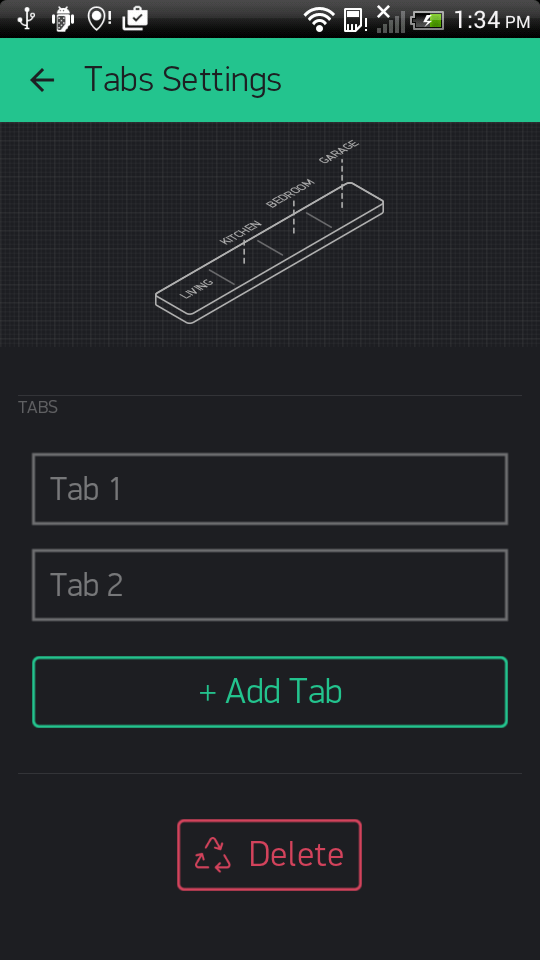

Menu
---------

Menu widget allows you to send command to your hardware based on selection you made on UI. Menu sends index of element you selected and not label string. Sending index is starts from 1. It works same way as usual ComboBox element. You can also set Menu items from hardware side, :ref:`change-widget-properties`.

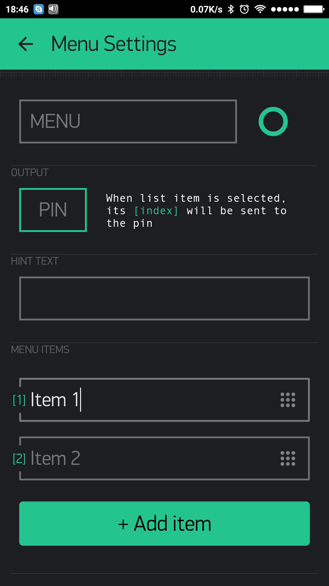

Example code:

.. code:: c++

    switch (param.asInt())
    {
        case 1: { // Item 1
            Serial.println("Item 1 selected");
            break;
        }
        case 2: { // Item 2
            Serial.println("Item 2 selected");
            break;
        }    
    }

**Sketch**: `Menu`__

.. __: https://github.com/blynkkk/blynk-library/blob/master/examples/Widgets/Menu/Menu.ino

Time Input
----------

Time input widget allows you to select start/stop time, day of week, timezone, sunrise/sunset formatted values and send them to your hardware. Supported formats for time now are ``HH:MM`` and ``HH:MM AM/PM``.

Hardware will get selected on UI time as seconds of day (``3600 * hours + 60 * minutes``) for start/stop time. Time that widget sends to hardware is user local time. Selected days indexes:

.. code:: none

    Monday - 1
    Tuesday - 2
    ...
    Saturday - 6
    Sundays - 7

You can also change state of widget on UI. See below sketches.

**Sketch**: `Simple Time Input for start time`__

**Sketch**: `Advanced Time Input`__

**Sketch**: `Update Time Input State on UI`__

.. __: https://github.com/blynkkk/blynk-library/blob/master/examples/Widgets/TimeInput/SimpleTimeInput/SimpleTimeInput.ino
.. __: https://github.com/blynkkk/blynk-library/blob/master/examples/Widgets/TimeInput/AdvancedTimeInput/AdvancedTimeInput.ino
.. __: https://github.com/blynkkk/blynk-library/blob/master/examples/Widgets/TimeInput/UpdateTimeInputState/UpdateTimeInputState.ino

Map
-----------

Map widget allows you set points/pins on map from hardware side. This is very useful widget in case you have multiple devices and you want track their values on map.

You can send a point to map with regular virtual wrtei command:

.. code:: c++

    Blynk.virtualWrite(V1, pointIndex, lat, lon, "value");

We also created wrapper for you to make suage of map simpler:

You can change button labels from hardware with:

.. code:: c++

    WidgetMap myMap(V1);
    ...
    int index = 1;
    float lat = 51.5074;
    float lon = 0.1278;
    myMap.location(index, lat, lon, "value");

Using save ``index`` allows you to override existing point value.

**Sketch**: `Basic Sketch`__

.. __: https://github.com/blynkkk/blynk-library/blob/master/examples/Widgets/Map/Map.ino

Table
-----------

Table widget comes handy when you need to structure similar data within 1 graphical element. It works as a usual table.

You can add a row to the table with:

.. code:: c++

    Blynk.virtualWrite(V1, "add", id, "Name", "Value");

You can update a row in the table with:

.. code:: c++

    Blynk.virtualWrite(V1, "update", id, "UpdatedName", "UpdatedValue");

To highlight any item in a table by using it’s id in a table:

.. code:: c++

    Blynk.virtualWrite(V1, "pick", 0);

To select/deselect (make icon green/grey) item in a table by using it’s row id in a table:

.. code:: c++
    
    Blynk.virtualWrite(V1, "select", 0);
    Blynk.virtualWrite(V1, "deselect", 0);

To clear the table at any time with:

.. code:: c++

    Blynk.virtualWrite(V1, "clr");

You can also handle other actions coming from table. For example, use row as a switch button.

.. code:: c++

    BLYNK_WRITE(V1) {
        String cmd = param[0].asStr();
        if (cmd == "select") {
            //row in table was selected. 
            int rowId = param[1].asInt();
        }
        if (cmd == "deselect") {
            //row in table was deselected. 
            int rowId = param[1].asInt();
        }
        if (cmd == "order") {
            //rows in table where reodered
            int oldRowIndex = param[1].asInt();
            int newRowIndex = param[2].asInt();
        }
    }

.. note::

    Max number of rows in the table is 100. When you reach the limit, table will work as FIFO (First In First Out) list. This limit can be changed by configuring **table.rows.pool.size** property for Local Server.

**Sketch**: `Simple Table usage`__

**Sketch**: `Advanced Table usage`__

.. __: https://github.com/blynkkk/blynk-library/blob/master/examples/Widgets/Table/Table_Simple/Table_Simple.ino
.. __: https://github.com/blynkkk/blynk-library/blob/master/examples/Widgets/Table/Table_Advanced/Table_Advanced.ino

Device Management
=================

Device Selector
-------------------

Device selector is a powerful widget which allows you to update widgets based on one active device. This widget is particlularly helpful when you have a fleet of devices with similar functionality.

Imagine you have 4 devices and every device has a Temperature & Humidity sensor connected to it. To display the data for all 4 devices you would need to add 8 widgets.

With Device Selector, you can use only 2 Widgets which will display Temperature and Humidity based on the active device chosen in Device Selector.

All you have to do is:

1. Add Device Selector Widget to the project
2. Add 2 widgets (for example Value Display Widget) to show Temperature and Humidity
3. In Widgets Settings you will be able assign them to Device Selector (Source or Target section)
4. Exit settings, Run the project.

Now you can change the active device in Device Selector and you will see that Temperature and Humidity values are reflecting the data updates for the device you just picked.

.. note::

    Webhook Widget will not work with Device Selector (yet).

Device Tiles
-------------

Device tiles is a powerful widget and very similar to the device selector widget, but with UI. It allows you to display 1 pin per device per tile. This widget is particularly helpful when you have a fleet of devices with similar functionality. So you can group similar devices within one layout (template).

Sensors
=======

Accelerometer, Barometer/pressure, Gravity, Humidity, Light, Proximity, Temperature, GPS Trigger, GPS Streaming.

See `here`__.

.. __: http://docs.blynk.cc/#widgets-sensors

Other
=======

Bridge, Eventor, RTC, BLE, Bluetooth, Music Player, Webhook, Reports Widget.

See `here`__.

.. __: http://docs.blynk.cc/#widgets-other

RTC
-------

Real-time clock allows you to get time from server. You can preselect any timezone on UI to get time on hardware in required locale. No pin required for RTC widget.

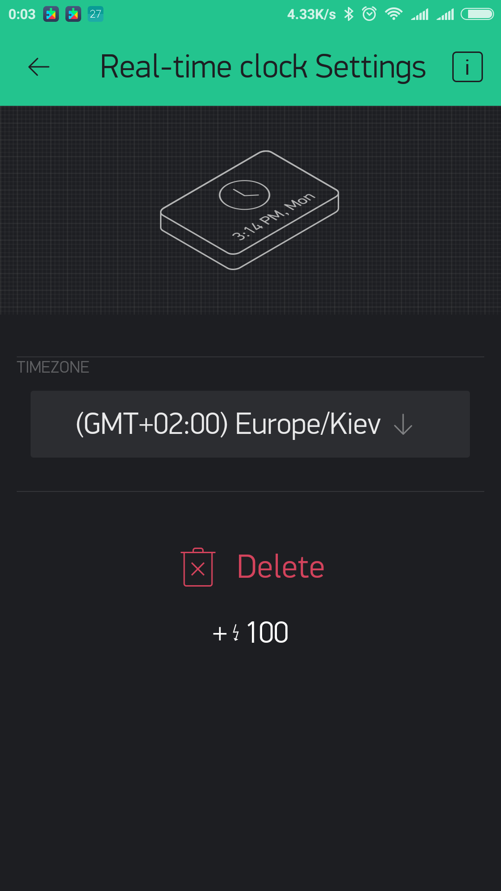

**Sketch**: `RTC`__

.. __: https://github.com/blynkkk/blynk-library/blob/master/examples/Widgets/RTC/RTC.ino

Webhook
---------

Webhook is a widget designed to communicate with 3rd party services. With Webhook widget you can send HTTP(S) requests to any 3rd party service or device that has HTTP(S) API (e.g. Philips Hue bulb). You can trigger 3-d party service with a single click of a button.

Any ``write`` operation from hardware side will trigger Webhook Widget. You can also trigger webhook from Blynk app when a app widget is assigned to the same pin as Webhook.

For example, when you need to send data from your hardware not only to Blynk, but also to Thingspeak, you would need to write a long http request code like this (this is just an example, not a full sketch):

.. code: c++

    WiFiClient client;
    if (client.connect("api.thingspeak.com", 80)) {
        client.print("POST /update HTTP/1.1\n");
        client.print("Host: api.thingspeak.com\n");
        client.print("Connection: close\n");
        client.print("X-THINGSPEAKAPIKEY: " + apiKeyThingspeak1 + "\n");
        client.print("Content-Type: application/x-www-form-urlencoded\n");
        client.print("Content-Length: ");
        client.print(postStr.length());
        client.print("\n\n");
        client.print(postStr);
    }

Instead, with Webhook widget you would only need to fill in these fields:

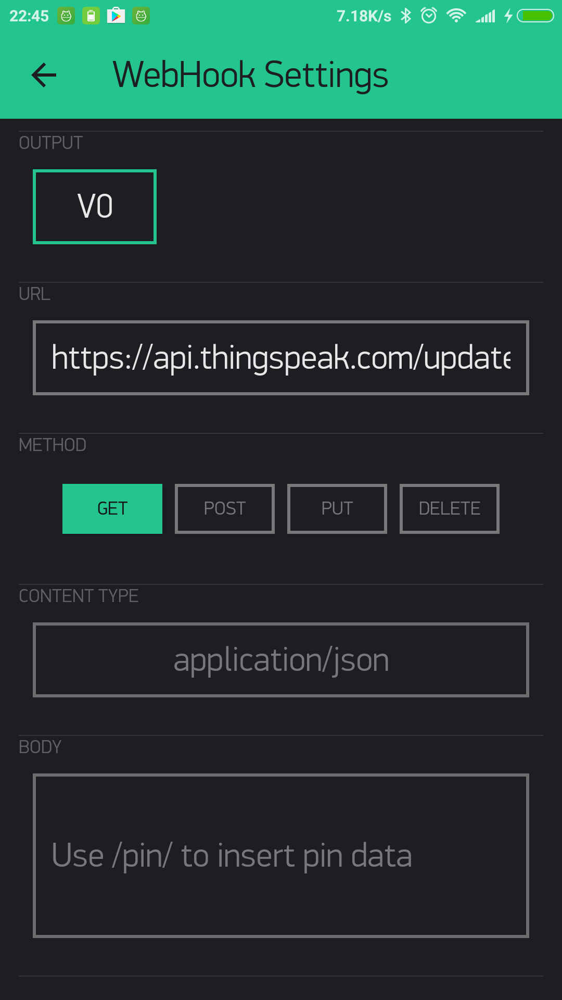

And add this code on hardware side:

.. code: c++

    Blynk.virtualWrite(V0, value);

where ``V0`` is pin assigned to the Webhook widget.

Use standard Blynk placeholders for Pin Value in the body or URL, for example:

.. code: none

    https://api.thingspeak.com/update?api_key=xxxxxx&field1=/pin/

or for the body

.. code: none

    ["/pin/"]

When you need to send an array of values, you can refer to a specific index of the array value. Blynk Pin can hold an array of max 10 values:

``/pin[0]/`` , ``/pin[1]/`` , ``/pin[2]/``

You can also make GET requests from Blynk server and get responses directly to your hardware.

For example, to get current weather from a 3rd party Weather service that uses an URL similar to this: ``http://api.sunrise-sunset.org/json?lat=33.3823&lng=35.1856&date=2016-10-01``, you would need to put this URL in Webhook widget and assign it to ``V0`` pin.

To parse the response on the hardware side:

.. code: c++

    BLYNK_WRITE(V0){
        String webhookdata = param.asStr();
        Serial.println(webhookdata);
    }

Now, every time there is a “write” command to ``V0`` pin (e.g. ``with Blynk.virtualWrite(V0, 1)`` from hardware or from app widget assigned to ``V0``), ``BLYNK_WRITE(V0)`` construction will be triggered and processed.

.. note::

    Usually, 3rd party servers return long responses. You have to increase the maximum allowed message size your hardware can process. Modify this line in your firmware code:

``#define BLYNK_MAX_READBYTES 1024``. Where ``1024`` - is maximum allowed message size.

.. note::

    Blynk Cloud has limitation for Webhook Widget - you can only send 1 request per second. This can be changed on a Local Server by changing ``webhooks.frequency.user.quota.limit``. Be careful with Webhooks, as many 3rd party services can’t handle 1 req/sec, and you can be banned on some of them. For example, Thingspeak allows only 1 request per 15 seconds.

.. note::

    To avoid spamming, Blynk Webhook feature has another limitation - if your Webhook requests fail 10 times in a row, Webhook Widget will be stopped. To resume it, you would need to open Widget Settings and re-save it. Failed request is a request that doesn’t return ``200`` or ``302``.

.. note::

    Webhook widget may affect ``Blynk.syncAll()`` function when a returned response is large.

Reports Widget
---------------

Function of Reports is to configure and customize data reports in CSV format. You can choose between one-time or continuous scheduled reports.

Also, within the Reports you can clear all the data collected by your devices.

* Two Mode:
    You need to configure initial inputs in Edit mode, and then, in Play mode you will be able to customize reports.

    * Edit mode. Data inputs configuration
        In edit mode (when your project is stopped) you define the Datastreams you would like to later be included in reports. Reports widget is designed to work with the Device Tiles widget. If you don’t use Device Tiles you can still select a single device or a group of devices as a source of data for reports.

        You have to choose either Device Tiles or single / group of the devices for the report. You can’t combine these 2 options.

    * Play mode.
        After you added source devices and their Datastreams click Play button and click on the Reports button.

* Customizing Reports

    Every Report option supposes it’s own settings:

    * **Report name** - give your report a meaningful name.
    * **Data source** - select the Datastreams you would like to be included in reports.
    * **Report Frequency** - Defines how often reports will be sent. 
    
        They can be one-time and scheduled. ``one-time`` - will instantly generate report and send it to the email addresses specified. Click on the right icon to send it.

        Scheduled reports can be sent ``daily``/``weekly``/``monthly``.

        ``At Time`` will set up a time of the day the report will be sent. ``Start``/``End`` specifies start and end date the reports will continue to be sent.

        For Weekly Report you can select a day of the week when report should be sent. For Monthly report you can choose whether to send report on the first or last day of the month.

    * **Recipients** - specify up to 5 email addresses.

    * **Data resolution** defines granularity of your reports. Supported granularities are: **minute**, **hourly** and **daily**. For example, when you generate daily report with 1 minute granularity you’ll get **24 * 60 * 60** points in your daily report for every selected Datastream.

    * **Group data in reports by** - specify the output format of the CSV file(s).

        * **Datastream** you will get 1 CSV file for each Datastream.

        * **Device** you will get 1 CSV file per each device. Each file will contain all of the included Datastreams.

        * **Report** you will get 1 CSV file for all your devices and all your Datastreams.

    * **Timezone correction** - specify the time zone adjustment if you need to get report date and time adjusted to a specific time zone

    * **Date and time format** - defines the format of the timestamp field of your data. You can select ``2018-06-21 20:16:48``, ``2018-06-21T20:16:48+03:00`` or other supported formats.

        There is one specific ``Timestamp`` format - which reflects the difference between the current time and midnight, January 1, 1970 UTC measured in milliseconds.

After the report is set up - click on ::guilabel:`OK` button at the right upper corner. Your report is ready.

Once you configured the report you will see when is the ``Next`` report scheduled and also a schedule for this report.

After the report was sent at least once, you can see when the ``Last`` report was sent.

``Last`` label also contains the status regarding the report:

* **OK**: the report was generated and sent to the Recipients successfully;
* **No** Data: the report doesn’t contain any data for the configured period;
* **Error**: something went wrong. Please contact the Blynk Team support;

Reports will be generated even if your project is not in active (Play) mode. However, inactive projects don’t generate any data.

.. note::
    
    all reports are encoded in UTF-16. Please, make sure you selected UTF-16 as required “Character set” for your csv reader.
